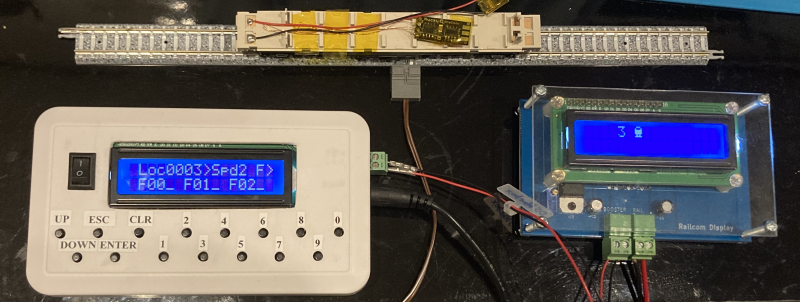
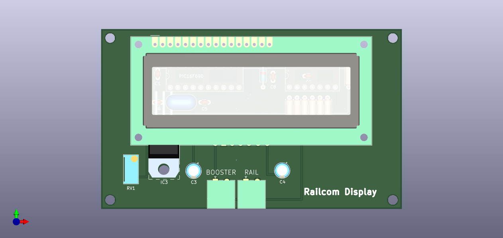

# KiCad-RailcomDisplay

KiCad6 project files for RailcomDisplay

## Description

This repository contains KiCad6 project files for RailcomDisplay. 

The RailcomDisplay is a local detector that displays data transmitted from RailCom supported decoders.

The schematic of RailcomDisplay is based on greate work of [Paco's Official Web Site](https://usuaris.tinet.cat/fmco/railcom_en.html#rdisplay)

## Artifacts

- [Schematic](./artifacts/RailcomDisplay-schematic.pdf)
- [BOM](https://htmlview.glitch.me/?https://github.com/kgh02017/KiCad-RailcomDisplay/blob/main/project/RailcomDisplay/bom/RailcomDisplay.html)

## Additional Info

The documentation and firmware of RailcomDisplay can be downloaded from [Paco's Official Web Site's download page](https://usuaris.tinet.cat/fmco/download_en.html).

### Documentation

-  [Manual](https://usuaris.tinet.cat/fmco/download/RailComDisplay_manual.pdf)

### Firmware of PIC16F690

-  [Firmware](https://usuaris.tinet.cat/fmco/download/RailComDisplay.zip)

